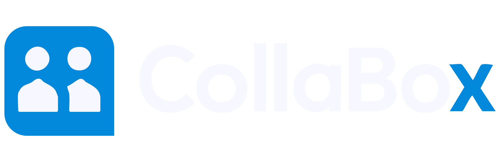

<p align="center">
  
  <h1 align="center">Collabox - Facility Management System</h1>
  <p align="center">This system enables multidisciplinary student teams from Computer Science/Software Engineer- ing and Engineering to collaborate on real-world projects carried out at government facilities. It provides a unified platform to manage programs, facilities, services, equipment, projects, partic- ipants, and outcomes, ensuring that projects are well-organized, properly resourced, and aligned with Uganda’s NDPIII, Digital Transformation Roadmap (2023–2028), and 4IR Strategy.

This Project was built with Laravel and strictly follows the MVC Architecture.</p>
  
  <p align="center">
    <a href="#features">Features</a> •
    <a href="#requirements">Requirements</a> •
    <a href="#installation">Installation</a> •
    <a href="#usage">Usage</a> •
    <a href="#license">License</a>
  </p>
</p>

## 🚀 Features
- **Collaboration**: Allows multidisciplinary student teams from Computer Science/Software Engineering and Engineering to collaborate on real-world projects carried out at government facilities.
- **Facility Management**: Track and manage multiple facilities with ease
- **Service Management**: Manage services in the various facilities
- **Equipment Management**: Keep track of equipment across facilities
- **Responsive Design**: Works on desktop and mobile devices
- **Modern UI**: Clean and intuitive user interface

## Setup Instructions (SQLite) - Windows OS

This guide will help you set up and run the Laravel project on **Windows** using **SQLite**. No additional server stack (XAMPP/WAMP) is required — just make sure you have PHP, Composer, Node.js, and Git setup correctly on your machine.

---

### Prerequisites

1. **PHP 8.1 or higher**  
   - Make sure PHP is installed and added to your system PATH.  
   - Required PHP extensions:
     - `pdo`
     - `pdo_sqlite`
     - `openssl`
     - `mbstring`
     - `tokenizer`
     - `xml`
     - `ctype`
     - `json`
2. **Composer** – PHP dependency manager  
   - [Get Composer](https://getcomposer.org/download/)
3. **Node.js & NPM** – For compiling frontend assets  
   - [Download Node.js](https://nodejs.org/en/download)
4. **Git** – For cloning the repository  
   - [Download Git](https://git-scm.com/downloads)

---

### Clone the repo

Open **Command Prompt** or **PowerShell** and run:

```bash
git clone https://github.com/Atala-Deborah/Advanced-Programming-Project-Group-17.git
```

```bash
cd Advanced-Programming-Project-Group-17/capstone-app
```

### Dependency Installations


1. Install PHP dependencies
```bash
composer install
```

2. Install NPM packages
```bash
npm install
```

3. Create environment file. (This will be shared in the group but you can as well create your own in the project directory using)

```bash
cp .env.example .env
```

4. Generate application key
```bash
php artisan key:generate
```

5. Configure database in `.env` file
```
DB_CONNECTION=sqlite
DB_HOST=127.0.0.1
DB_PORT=3306
DB_DATABASE=laravel
DB_USERNAME=root
DB_PASSWORD=ap.capstone
```

6. Create SQLite database file. (This is if it doesn't exist already in capstone-app/database)
```bash
type nul > database/database.sqlite
```

7. Start the development server
```bash
php artisan serve
```

8. In a separate terminal, compile assets
```bash
npm run dev
```
(This will compile JavaScript and CSS assets required for the frontend)

Your application should now be running at `http://localhost:8000`

### Common Issues
- If you encounter any permissions issues, run commands as administrator
- Check that all required PHP extensions are enabled in php.ini
- Make sure the sqlite3 PHP extension is enabled in vs code
Your application should now be running at `http://localhost:8000`

### Common Issues
- If you encounter any permissions issues, run commands as administrator
- Make sure MySQL service is running before migrations
- Check that all required PHP extensions are enabled in php.ini

## FRONTEND DEVELOPMENT GUIDE
Key Frontend Locations:
`Views: resources/views/`
`CSS: resources/css/app.css`
`JavaScript: resources/js/app.js`
`Assets: public/`

### Development Server
Run Vite development server to compile and hot-reload assets:

```bash
npm run dev
```
Production Build

```bash
npm run build
```

## 📝 Usage

1. Register a new account or use the default admin credentials:
   - Email: admin@example.com
   - Password: password

2. Navigate through the dashboard to manage facilities, services, and equipment.

## 🤝 Contributing

Contributions are welcome! Please feel free to submit a Pull Request.

1. Fork the Project
2. Create your Feature Branch (`git checkout -b feature/AmazingFeature`)
3. Commit your Changes (`git commit -m 'Add some AmazingFeature'`)
4. Push to the Branch (`git push origin feature/AmazingFeature`)
5. Open a Pull Request

## 📄 License

This project is licensed under the MIT License - see the [LICENSE](LICENSE) file for details.

## 🙏 Acknowledgments

- Built with [Laravel](https://laravel.com)
- Frontend powered by [Tailwind CSS](https://tailwindcss.com/)
- Icons from [Heroicons](https://heroicons.com/)

## 🔒 Security

If you discover any security related issues, please email your team's security contact instead of using the issue tracker.

